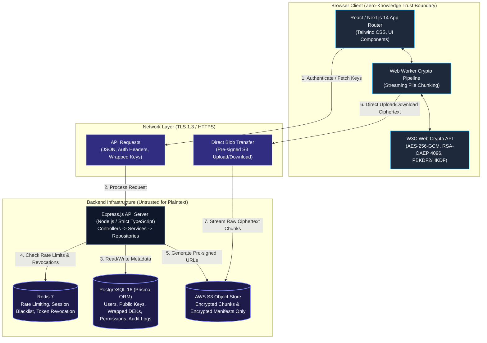
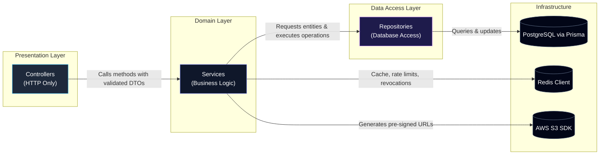
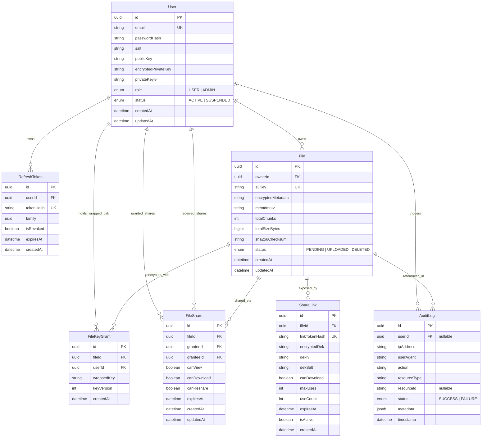
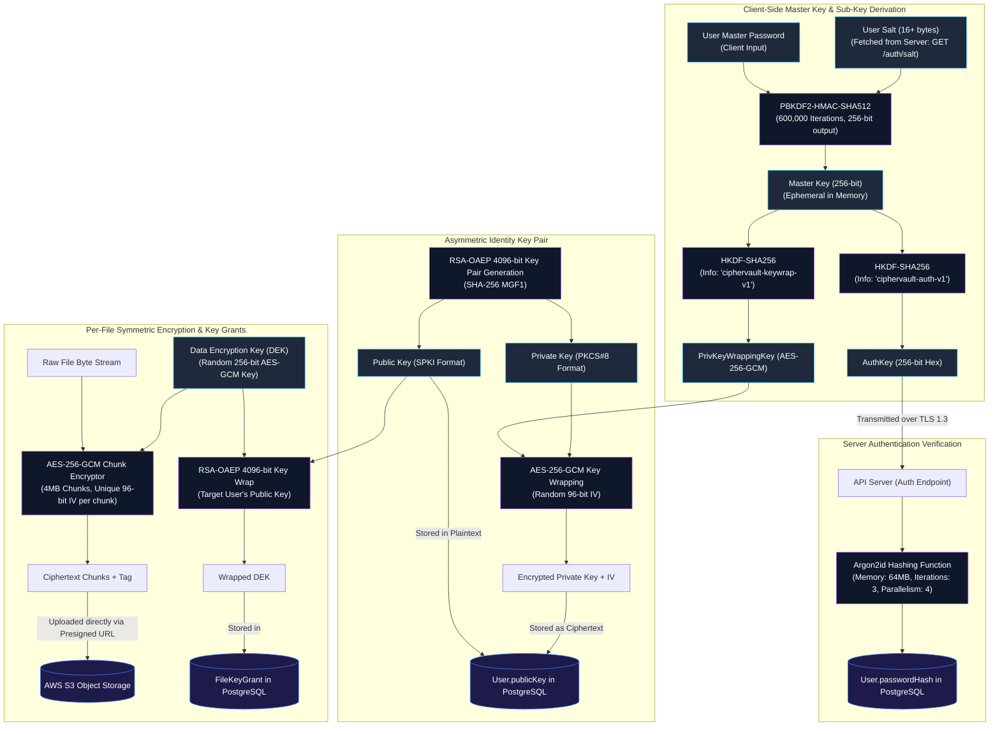
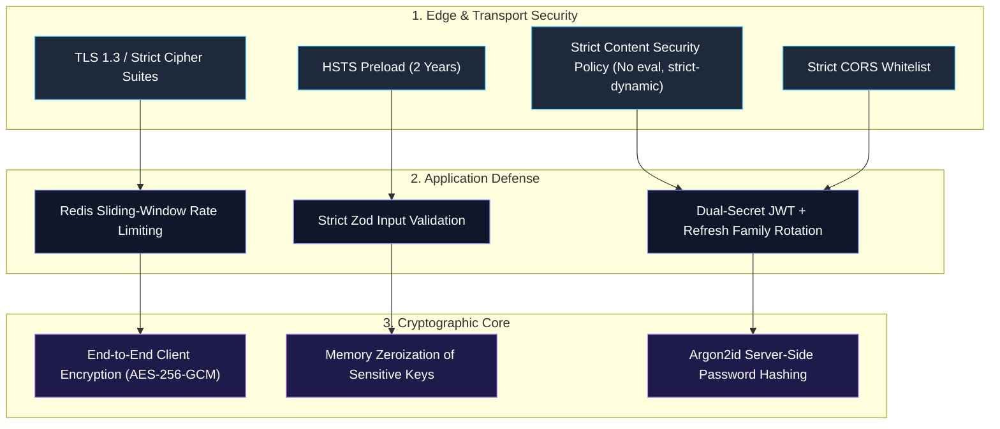

# CipherVault Architecture Specification

CipherVault is a production-grade, end-to-end encrypted (E2EE), zero-knowledge file sharing platform. It enables individuals and organizations to store, share, and collaborate on sensitive files with mathematical guarantees that no intermediary—including the storage tier, application servers, cloud providers, or database administrators—can ever access file contents, filenames, or cryptographic key material in plaintext.

---

## 1. System Overview

CipherVault operates on a strict **Zero-Knowledge Architecture** model:
- **Client-Side Cryptography**: All encryption, decryption, and key generation operations are executed exclusively within the user's browser runtime via the standard W3C Web Crypto API (`window.crypto.subtle`).
- **Untrusted Infrastructure**: The API server, relational database, Redis cache, and AWS S3 object store are treated as untrusted conveyance and storage mediums. The server only receives and stores ciphertext, initialization vectors, cryptographic salts, public keys, and wrapped key grants.
- **Zero Plaintext Exposure**: Plaintext data never touches the network wire or server disks. Plaintext filenames, file metadata, and file byte streams exist only in the client's transient memory and are cryptographically shielded before transmission.
- **Granular Cryptographic Access Control**: Access delegation uses asymmetric public-key cryptography. File Data Encryption Keys (DEKs) are wrapped individually for each authorized recipient using RSA-OAEP 4096-bit keys, ensuring access revocation and auditing can be strictly enforced.

---

## 2. Architecture Diagram

The system is partitioned into the Client Trust Boundary (browser-side zero-knowledge zone) and the Untrusted Cloud Infrastructure (API server, cache, database, and object storage).



---

## 3. Monorepo Structure

CipherVault is engineered as a unified TypeScript monorepo governed by strict package boundaries, decoupled concerns, and shared cryptographic and validation primitives.

```
ciphervault/
├── apps/
│   ├── web/                          # Next.js 14 frontend application (App Router)
│   │   ├── public/                   # Static public assets, favicon, manifest
│   │   ├── src/
│   │   │   ├── app/                  # Next.js App Router (pages, layouts, route handlers)
│   │   │   │   ├── (auth)/           # Route group: /login, /register, /recover
│   │   │   │   ├── (dashboard)/      # Route group: /files, /shares, /settings, /audit
│   │   │   │   ├── s/[linkId]/       # Public passphrase-protected share link receiver
│   │   │   │   ├── layout.tsx        # Global shell, font injection, CSP headers
│   │   │   │   └── providers.tsx     # Context providers (Auth, CryptoKey, Theme)
│   │   │   ├── components/           # Reusable UI components (buttons, modals, dropzones)
│   │   │   ├── hooks/                # React hooks (useAuth, useFileUpload, useFileDownload)
│   │   │   ├── lib/                  # HTTP client, environment validation, web utilities
│   │   │   └── workers/              # Dedicated Web Workers for non-blocking crypto operations
│   │   ├── package.json
│   │   └── tsconfig.json
│   │
│   └── api/                          # Express.js backend REST API
│       ├── prisma/                   # Database schema definitions and migration scripts
│       │   ├── schema.prisma         # Prisma schema for PostgreSQL
│       │   └── migrations/           # Versioned SQL migration histories
│       ├── src/
│       │   ├── config/               # Typed environment configuration, logger, AWS & Redis clients
│       │   ├── controllers/          # HTTP request handlers (parameter extraction & validation)
│       │   ├── services/             # Core business logic, authorization & lifecycle management
│       │   ├── repositories/         # Database abstraction layer using Prisma client
│       │   ├── middleware/           # Express middleware (auth, rate-limit, audit, error-handler)
│       │   ├── routes/               # Modular Express router declarations
│       │   ├── utils/                # Server-side utilities (hashing, audit helpers, S3 presigners)
│       │   └── index.ts              # Server bootstrap and graceful shutdown hooks
│       ├── package.json
│       └── tsconfig.json
│
├── packages/
│   ├── shared/                       # Cross-cutting types, validation schemas, and constants
│   │   ├── src/
│   │   │   ├── constants/            # Cryptographic constants, limits, MIME classifications
│   │   │   ├── schemas/              # Zod validation schemas (Auth, File, Share, User DTOs)
│   │   │   ├── types/                # Canonical TypeScript types, interfaces, and Enums
│   │   │   └── index.ts              # Package entry point
│   │   ├── package.json
│   │   └── tsconfig.json
│   │
│   └── crypto/                       # Web Crypto API wrappers and cryptographic primitives
│       ├── src/
│       │   ├── aes.ts                # AES-256-GCM chunked file encryption and decryption
│       │   ├── rsa.ts                # RSA-OAEP 4096-bit keygen, wrapping, and unwrapping
│       │   ├── kdf.ts                # PBKDF2-HMAC-SHA512 and HKDF-SHA256 derivations
│       │   ├── stream.ts             # TransformStreams for continuous stream-based ciphering
│       │   ├── utils.ts              # ArrayBuffer, Base64Url, and Hex encoders/decoders
│       │   ├── zeroize.ts            # Secure zeroing of sensitive typed memory buffers
│       │   └── index.ts              # Public cryptographic module exports
│       ├── package.json
│       └── tsconfig.json
│
├── docker/
│   ├── Dockerfile.web                # Multi-stage production build for Next.js web application
│   ├── Dockerfile.api                # Multi-stage production build for Express API service
│   ├── docker-compose.yml            # Local development orchestration (Postgres, Redis, MinIO)
│   └── docker-compose.prod.yml       # Production container orchestration template
│
├── .env.example                      # Documented template of required environment variables
├── package.json                      # Turborepo root workspace configuration
├── turbo.json                        # Monorepo build pipeline and cache invalidation rules
└── tsconfig.base.json                # Shared root TypeScript strict compiler configuration
```

### Module Responsibilities

| Module | Runtime | Responsibility |
| :--- | :--- | :--- |
| `apps/web` | Browser / Node SSR | Next.js user interface, Web Worker offloading, client-side session state, and streaming file uploads/downloads. |
| `apps/api` | Node.js (v20+) | Authenticating requests, orchestrating permissions, interacting with PostgreSQL/Redis, generating S3 pre-signed URLs, and recording immutable audit logs. |
| `packages/shared`| Universal (Isomorphic) | Source of truth for Zod schemas, HTTP request/response DTOs, domain enums, and API error codes. Zero platform-specific dependencies. |
| `packages/crypto`| Universal (Web Crypto) | Cryptographic engine wrapping W3C SubtleCrypto. Handles key derivations, AES chunking, RSA key pair generation, key wrapping, and memory zeroization. |
| `docker/` | Docker Engine | Container recipes and local infrastructure services (PostgreSQL 16, Redis 7, MinIO S3 emulation). |

---

## 4. Module Boundaries & Layered Architecture

The backend follows a strict **Three-Tier Architecture**: **Controller $\rightarrow$ Service $\rightarrow$ Repository**. No file is permitted to bypass layers or conflate distinct architectural concerns.



### Architectural Rules & Isolation Constraints

1. **Controllers (`apps/api/src/controllers`)**:
   - Sole responsibility: Parse incoming HTTP requests, extract parameters/cookies/body, validate input payloads against `@ciphervault/shared` Zod schemas, invoke the corresponding service method, and format HTTP responses.
   - **Forbidden**: Direct database calls, Prisma imports, executing business logic, or orchestrating multi-step mutations.
2. **Services (`apps/api/src/services`)**:
   - Sole responsibility: Execute domain rules, verify granular authorization (ownership, share permissions, link expiry, reuse detection), orchestrate database transactions across repositories, dispatch audit events, and interface with external infrastructure clients (S3 presigning, Redis caching).
   - **Forbidden**: Reading Express `req` or `res` objects, parsing HTTP headers, or returning HTTP-specific codes directly.
3. **Repositories (`apps/api/src/repositories`)**:
   - Sole responsibility: Encapsulate all database interaction via the Prisma Client. Construct performant queries, manage indexes, handle transactions, and return strongly-typed database models.
   - **Forbidden**: Invoking HTTP primitives, enforcing high-level application business decisions, or communicating with external network services (S3/Redis).

---

## 5. Database Schema & Data Models

CipherVault persists all relational state in PostgreSQL using Prisma ORM.

### Model Descriptions & Relationships

1. **User**:
   - Represents an identity in the system.
   - Stores authentication parameters (Argon2id password hash derived from `AuthKey`, unique PBKDF2 salt), user public key (RSA-OAEP 4096-bit in SPKI format), and the user's encrypted private key (wrapped with `PrivKeyWrappingKey` via AES-256-GCM alongside its IV).
   - Governs user roles (`USER`, `ADMIN`) and account status (`ACTIVE`, `SUSPENDED`).
2. **RefreshToken**:
   - Implements strict Refresh Token Rotation with automatic token family tracking and reuse detection.
   - Stores the SHA-256 hash of the refresh token, the token family UUID, revocation flag, and absolute expiration timestamp.
3. **File**:
   - Represents an encrypted file container.
   - Tracks the owner (`userId`), unique S3 storage key, encrypted metadata blob (AES-GCM encrypted JSON containing original filename, MIME type, and size), initialization vector, total chunk count, total encrypted byte size, ciphertext SHA-256 checksum, and file lifecycle status (`PENDING`, `UPLOADED`, `DELETED`).
4. **FileKeyGrant**:
   - **Cryptographic Separation**: Decoupled from permissions to ensure access rights can be revoked or re-granted without re-encrypting underlying S3 data.
   - Stores the Data Encryption Key (DEK) wrapped under the recipient's RSA-OAEP public key. Every authorized user (including the file owner) has an individual `FileKeyGrant` record.
5. **FileShare**:
   - Represents an internal access permission grant between a granter and grantee.
   - Enforces granular capabilities: `canView` (metadata access), `canDownload` (ciphertext access), and `canReshare` (delegated key-granting privilege), with an optional expiration timestamp.
6. **ShareLink**:
   - Enables anonymous or public recipient file sharing protected by a user-supplied passphrase or ephemeral token.
   - Stores the SHA-256 hash of the public link token, the DEK encrypted via AES-256-GCM using a PBKDF2 key derived from the passphrase, initialization vector, PBKDF2 salt, access bounds (`canDownload`, `maxUses`, `useCount`), expiration timestamp, and active status flag.
7. **AuditLog**:
   - Provides an immutable, append-only chronological log of all security-sensitive actions across the platform.
   - Tracks actor ID, client IP address, user-agent string, action classification enum, target resource type and ID, success/failure status, and contextual structured metadata.

### Mermaid ER Diagram



---

## 6. Key Hierarchy & Cryptographic Derivation

CipherVault enforces a zero-knowledge key hierarchy rooted in the user's master passphrase. The plaintext passphrase never traverses the network.



---

## 7. API Endpoints

All authenticated routes require a valid short-lived JSON Web Token (`Bearer <JWT>`) in the `Authorization` header, or a valid secure session cookie.

| Method | Path | Auth Required | Rate Limit | Description | Request Body / Parameters | Response Summary |
| :--- | :--- | :---: | :---: | :--- | :--- | :--- |
| `GET` | `/auth/salt` | No | 60 req/min | Fetch user's cryptographic PBKDF2 salt by email. | Query: `?email=<string>` | `{ salt: string }` |
| `POST` | `/auth/register` | No | 5 req/min | Register a new account with keys and salt. | `{ email, authKey, salt, publicKey, encryptedPrivateKey, privateKeyIv }` | `{ user: UserDto, tokens: TokenPair }` |
| `POST` | `/auth/login` | No | 5 req/min | Authenticate using client-derived `AuthKey`. | `{ email, authKey }` | `{ user: UserDto, tokens: TokenPair }` |
| `POST` | `/auth/refresh` | No | 30 req/min | Rotate refresh token and issue new access token. | Cookie: `refreshToken` or `{ refreshToken: string }` | `{ tokens: TokenPair }` |
| `POST` | `/auth/logout` | Yes | 30 req/min | Invalidate active refresh token family in Redis. | Cookie or `{ refreshToken: string }` | `{ success: true }` |
| `POST` | `/auth/change-password` | Yes | 3 req/min | Update auth key and re-wrap private key. | `{ currentAuthKey, newAuthKey, newSalt, newEncryptedPrivateKey, newPrivateKeyIv }` | `{ success: true }` |
| `GET` | `/users/me` | Yes | 60 req/min | Retrieve current user profile and wrapped private key. | None | `{ user: UserProfileDto }` |
| `PATCH` | `/users/me` | Yes | 20 req/min | Update user display preferences and settings. | `{ name?: string, preferences?: object }` | `{ user: UserProfileDto }` |
| `GET` | `/users/public-key` | Yes | 100 req/min | Fetch another user's RSA-OAEP public key to share. | Query: `?email=<string>` | `{ userId: string, publicKey: string }` |
| `POST` | `/files/init-upload` | Yes | 30 req/min | Initialize chunked upload and request presigned S3 URLs. | `{ encryptedMetadata, metadataIv, totalChunks, totalSizeBytes, sha256Checksum, wrappedKey }` | `{ fileId: string, uploadUrls: string[], s3Key: string }` |
| `POST` | `/files/:id/complete-upload` | Yes | 30 req/min | Finalize multipart upload and verify checksums. | `{ parts: { partNumber: number, etag: string }[] }` | `{ file: FileDto }` |
| `GET` | `/files` | Yes | 60 req/min | List files owned by or shared with the user. | Query: `?page=1&limit=20&filter=all|owned|shared` | `{ files: FileDto[], meta: PaginationMeta }` |
| `GET` | `/files/:id` | Yes | 60 req/min | Get file metadata and recipient's wrapped DEK. | Param: `:id` | `{ file: FileDto, wrappedKey: string }` |
| `GET` | `/files/:id/download-url` | Yes | 30 req/min | Generate pre-signed S3 download URL(s) for ciphertext. | Param: `:id` | `{ downloadUrls: string[], file: FileDto, wrappedKey: string }` |
| `DELETE` | `/files/:id` | Yes | 30 req/min | Mark file as deleted and queue S3 blob deletion. | Param: `:id` | `{ success: true }` |
| `POST` | `/files/:id/shares` | Yes | 30 req/min | Grant file access to a user with wrapped DEK. | `{ granteeId: string, wrappedKey: string, permissions: { canView, canDownload, canReshare }, expiresAt?: string }` | `{ share: FileShareDto }` |
| `GET` | `/files/:id/shares` | Yes | 60 req/min | List active user shares for a specific file. | Param: `:id` | `{ shares: FileShareDto[] }` |
| `DELETE` | `/shares/:id` | Yes | 30 req/min | Revoke a specific user share and associated key grant. | Param: `:id` | `{ success: true }` |
| `POST` | `/files/:id/share-links` | Yes | 20 req/min | Create a public passphrase-protected share link. | `{ encryptedDek, dekIv, dekSalt, canDownload, maxUses?: number, expiresAt?: string }` | `{ shareLink: ShareLinkDto, linkUrl: string }` |
| `GET` | `/share-links/:id` | No | 60 req/min | Resolve public share link metadata and encrypted DEK. | Param: `:id` | `{ shareLink: PublicShareLinkDto, downloadUrl?: string }` |
| `DELETE` | `/share-links/:id` | Yes | 30 req/min | Deactivate or delete a public share link. | Param: `:id` | `{ success: true }` |
| `GET` | `/audit` | Yes | 60 req/min | Retrieve user-specific audit event history. | Query: `?page=1&limit=50&action=<string>` | `{ events: AuditLogDto[], meta: PaginationMeta }` |
| `GET` | `/admin/users` | Yes (Admin) | 30 req/min | List all platform users with filtering. | Query: `?page=1&limit=50&status=ACTIVE|SUSPENDED` | `{ users: AdminUserDto[], meta: PaginationMeta }` |
| `PATCH` | `/admin/users/:id` | Yes (Admin) | 20 req/min | Update user status (suspend, reactivate, change role). | `{ status?: "ACTIVE" \| "SUSPENDED", role?: "USER" \| "ADMIN" }` | `{ user: AdminUserDto }` |
| `GET` | `/admin/audit` | Yes (Admin) | 30 req/min | View system-wide audit logs with rich filters. | Query: `?page=1&limit=100&userId=<uuid>&action=<string>` | `{ events: AuditLogDto[], meta: PaginationMeta }` |
| `GET` | `/health` | No | None | Basic liveness probe endpoint. | None | `{ status: "ok", timestamp: string }` |
| `GET` | `/ready` | No | None | Readiness probe checking DB, Redis, and S3 connectivity.| None | `{ status: "ready", database: true, redis: true, s3: true }` |

---

## 8. Data Flow Diagrams

### 8.1 Upload Flow (7 Steps)

```mermaid
sequenceDiagram
    autonumber
    actor User as User Browser
    participant Worker as Web Worker Crypto
    participant API as API Server (Express)
    participant DB as PostgreSQL
    participant S3 as AWS S3 Storage

    User->>Worker: 1. Select file; generate random 256-bit AES DEK; slice file into 4MB chunks
    Worker->>Worker: 2. Encrypt chunks & manifest (filename, size, MIME) with AES-256-GCM; compute SHA-256
    Worker->>Worker: 3. Wrap DEK with User's RSA-OAEP 4096-bit public key
    Worker->>API: 4. POST /files/init-upload (wrappedKey, encryptedMetadata, metadataIv, totalChunks, checksum)
    API->>DB: Store File (status: PENDING) & FileKeyGrant (owner's wrapped DEK)
    API->>S3: Request Pre-signed Multipart S3 Upload URLs
    API-->>Worker: Return fileId & pre-signed S3 upload URLs
    Worker->>S3: 5. Stream & upload ciphertext chunks directly to S3 via pre-signed URLs
    Worker->>API: 6. POST /files/:id/complete-upload (fileId, array of part ETags)
    API->>S3: Complete multipart upload & verify S3 object integrity
    API->>DB: 7. Update File status to UPLOADED; insert AuditLog entry
    API-->>User: Return complete FileDto confirmation
```

### 8.2 Download Flow (5 Steps)

```mermaid
sequenceDiagram
    autonumber
    actor User as User Browser
    participant Worker as Web Worker Crypto
    participant API as API Server (Express)
    participant DB as PostgreSQL
    participant S3 as AWS S3 Storage

    User->>API: 1. GET /files/:id/download-url
    API->>DB: Verify ownership/share permission; retrieve FileKeyGrant & File metadata
    API->>S3: Generate Pre-signed S3 Download URL
    API-->>User: 2. Return pre-signed S3 URL, wrappedKey, encryptedMetadata, and IVs
    User->>S3: 3. Stream encrypted chunks directly from S3
    S3-->>Worker: Transmit raw ciphertext stream
    Worker->>Worker: 4. Unwrap DEK using User's decrypted RSA-OAEP private key
    Worker->>Worker: 5. Decrypt chunks with AES-256-GCM; verify SHA-256 checksum; rebuild plaintext file
    Worker-->>User: Trigger browser file download (Blob / SaveAs)
```

### 8.3 Share Flow (5 Steps)

```mermaid
sequenceDiagram
    autonumber
    actor UserA as Granter (User A)
    participant WorkerA as User A Web Worker
    participant API as API Server (Express)
    participant DB as PostgreSQL
    actor UserB as Grantee (User B)

    UserA->>API: 1. GET /users/public-key?email=userB@example.com
    API->>DB: Query User B's public key
    API-->>UserA: Return User B's RSA-OAEP 4096-bit Public Key (SPKI)
    UserA->>WorkerA: 2. Retrieve & unwrap file DEK from memory using User A's private key
    WorkerA->>WorkerA: 3. Re-wrap DEK with User B's RSA-OAEP public key
    UserA->>API: 4. POST /files/:id/shares (granteeId, wrappedKey, permissions, expiresAt)
    API->>DB: Verify User A permissions; in a single transaction insert FileShare & FileKeyGrant
    API->>DB: 5. Record AuditLog event (FILE_SHARE); send real-time notification
    API-->>UserA: Return ShareConfirmationDto
    Note over UserB,DB: User B can now decrypt the file using their own RSA private key
```

---

## 9. Security Architecture & Threat Model

CipherVault is engineered around defense-in-depth principles, strict adherence to zero-knowledge guarantees, and compliance with the guidelines set forth in `SECURITY.md`.

### Defense-in-Depth Measures



### Content Security Policy (CSP)

The Next.js web application enforces a strict Content Security Policy to eliminate Cross-Site Scripting (XSS), data exfiltration, and unauthorized iframe embedding:

```http
Content-Security-Policy:
  default-src 'none';
  script-src 'self' 'nonce-{RANDOM}';
  worker-src 'self' blob:;
  connect-src 'self' https://api.ciphervault.io https://*.s3.amazonaws.com https://s3.amazonaws.com;
  img-src 'self' data:;
  style-src 'self' 'unsafe-inline';
  font-src 'self';
  frame-ancestors 'none';
  base-uri 'none';
  form-action 'self';
```

### Cross-Origin Resource Sharing (CORS) Policy

The API server rejects unauthorized cross-origin requests:
- Allowed origins are locked to the configured web application origin (e.g., `https://ciphervault.io` or `http://localhost:3000` in development).
- Allowed methods: `GET, POST, PATCH, DELETE, OPTIONS`.
- Allowed headers: `Content-Type, Authorization, X-Requested-With`.
- Credentials flag: `true` (enabling transmission of secure `HttpOnly` refresh token cookies).

### Rate Limiting Strategy

Rate limiting is enforced at the API gateway layer using Redis sliding-window counters:
- **Public Salt & Login Endpoints**: Strict limit of 5 requests per minute per IP address to prevent brute-force attacks and user enumeration.
- **Token Refresh**: 30 requests per minute per IP to accommodate client token rotation.
- **Authenticated File Operations**: 60 requests per minute per authenticated user to prevent denial-of-service against storage and database backends.
- **Admin Endpoints**: 30 requests per minute per admin account, accompanied by mandatory audit log records.

### JWT Dual-Secret Authentication Architecture

Authentication uses short-lived access credentials combined with rotating long-lived refresh credentials:

1. **Access Token (Short-Lived: 15 Minutes)**:
   - Formatted as a compact JWT signed using `jose` with an ephemeral secret key (`JWT_ACCESS_SECRET`).
   - Carries user ID, email, role, and active session identifiers.
   - Sent by the client in the `Authorization: Bearer <token>` header.
2. **Refresh Token (Long-Lived: 7 Days)**:
   - Opaque cryptographically random 256-bit token issued inside an `HttpOnly`, `Secure`, `SameSite=Strict` cookie.
   - Only the SHA-256 hash of the token is persisted in PostgreSQL.
   - **Token Family & Reuse Detection**: Every refresh token belongs to a token `family`. Upon issuance of a new access token, the old refresh token is marked as revoked and replaced with a new token in the same family. If an already-revoked refresh token is ever submitted, the entire token family is immediately invalidated in Redis and PostgreSQL, locking out potential adversaries who intercepted an expired token.

### Memory Zeroization & Cryptographic Hygiene

Sensitive cryptographic keys, decrypted byte buffers, and user master credentials are encapsulated in typed arrays (`Uint8Array`) and wiped from memory using `crypto.getRandomValues()` or zero-fill passes immediately after use via the `@ciphervault/crypto` zeroize utility.

---

## 10. Technology Stack

| Component | Technology | Rationale & Selection Criteria |
| :--- | :--- | :--- |
| **Frontend Framework** | **Next.js 14+ (App Router)** | Modern server/client component boundaries, streaming UI rendering, optimal asset loading, and tight integration with Web Workers. |
| **Backend Framework** | **Express.js (Node.js 20+ LTS)** | Lightweight, battle-tested, unopinionated HTTP pipeline with extensive middleware support and minimal runtime overhead. |
| **Language** | **TypeScript 5.4+ (Strict Mode)** | Complete end-to-end type safety. Configuration sets `strict: true`, `noImplicitAny: true`, and strict null checks across all apps and shared libraries. |
| **Database** | **PostgreSQL 16** | ACID-compliant relational storage, robust indexing, JSONB support for audit log metadata, and strong concurrency guarantees. |
| **ORM / Data Layer** | **Prisma ORM** | Type-safe query construction, automated schema migrations, relation modeling, and protection against SQL injection. |
| **Cache & State Store** | **Redis 7** | Sub-millisecond sliding-window rate limiting, active session blacklisting, and instant refresh token family revocation. |
| **Object Storage** | **AWS S3 / MinIO** | High-durability scalable blob storage. Decoupled from backend compute using pre-signed multipart upload and download URLs. |
| **Cryptography (Client)**| **W3C Web Crypto API (`SubtleCrypto`)** | Hardware-accelerated browser native cryptographic engine (AES-GCM, RSA-OAEP, PBKDF2, HKDF) eliminating third-party JS crypto vulnerabilities. |
| **Password Hashing** | **Argon2id (`argon2`)** | Winner of the Password Hashing Competition. State-of-the-art resistance against GPU/ASIC cracking and side-channel attacks for server-side auth keys. |
| **Validation** | **Zod** | TypeScript-first runtime schema validation shared between API controllers and web form handlers for zero-drift payload validation. |
| **Token Management** | **`jose`** | Lightweight, standards-compliant, dependency-free library for JWT, JWS, and JWK operations across modern runtimes. |
| **Containerization** | **Docker & Docker Compose** | Reproducible multi-stage container builds and localized development environments with embedded Postgres, Redis, and MinIO. |
