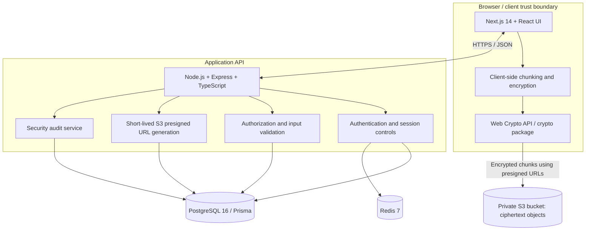

<<<<<<< Updated upstream
# CipherVault — End-to-End Encrypted File Sharing

CipherVault is a secure file-sharing platform designed around client-side encryption. Files are encrypted in the browser before upload, while the API manages authentication, permissions, encrypted metadata, key grants, share links, and audit events. Encrypted file chunks are transferred directly between the browser and a private S3 bucket using short-lived presigned URLs.
=======
# Secure File Sharing Platform (E2EE)

> **A production-quality, interview/portfolio-grade, genuine end-to-end encrypted (E2EE) cloud file sharing platform.**
> Plaintext files and raw encryption keys exist ONLY in the browser memory of an authorized user, transiently. The server, database, and S3 hold ONLY ciphertext, wrapped key material, and access-control/audit metadata.
>>>>>>> Stashed changes

> **Security note:** This is a portfolio project and a security-sensitive application. The architecture is designed around a zero-knowledge model, but that label is not a substitute for independent cryptographic review, production security testing, recovery testing, and careful deployment. Do not use it for irreplaceable or highly sensitive files without those checks.

<<<<<<< Updated upstream
## Contents

- [Features](#features)
- [Architecture](#architecture)
- [Technology stack](#technology-stack)
- [Security model and trade-offs](#security-model-and-trade-offs)
- [Prerequisites](#prerequisites)
- [Local development with Docker](#local-development-with-docker)
- [Environment variables](#environment-variables)
- [Run checks](#run-checks)
- [Deployment overview](#deployment-overview)
- [Repository hygiene before deployment](#repository-hygiene-before-deployment)
- [Known limitations and hardening checklist](#known-limitations-and-hardening-checklist)
- [License](#license)

## Features
=======
## 1. Non-Negotiable Architectural Rules

1. **Zero Plaintext Files on Backend**: The Express backend must NEVER receive, log, or store plaintext file contents. Only ciphertext reaches the server / S3.
2. **True Cryptography Only**: No base64-as-encryption, no "hash and call it encrypted", no server-side AES after receiving plaintext.
3. **In-Memory JWT Access Tokens**: Access tokens are kept in client memory only (never `localStorage` or `sessionStorage`); session persistence uses a secure, `httpOnly`, rotating refresh-token cookie.
4. **IDOR Prevention by Construction**: Every protected endpoint verifies authentication AND authorization independently (ownership or explicit FileShare/FileKey grant). Queries are always filtered by the authenticated user's ID.
5. **Zero-Knowledge Admin Model**: The `ADMIN` role has NO special ability to decrypt files, unwrap keys, or bypass the envelope encryption model. Admin capabilities are strictly operational (account suspension, user management, audit visibility, force-revoking abusive links).
6. **No Committed Secrets**: Environment variables are used for all configuration via a strict `.env.example`.
>>>>>>> Stashed changes

- **Client-side file encryption:** Uses the browser Web Crypto API and AES-256-GCM helpers in `packages/crypto`.
- **Chunked uploads:** File data is encrypted in the browser and uploaded directly to a private S3 bucket with multipart uploads and short-lived presigned URLs. The API coordinates upload state and does not proxy the bulk file bytes.
- **Per-recipient key grants:** Each authorized recipient receives a copy of the file Data Encryption Key (DEK) wrapped with their RSA-OAEP public key.
- **Password-derived account keys:** PBKDF2-HMAC-SHA256 derives a master key in the browser; HKDF-SHA256 derives context-specific keys. The server receives an authentication key rather than the raw account password and hashes that authentication key with Argon2id.
- **Authentication sessions:** Short-lived JWT access tokens and rotating opaque refresh tokens. The database stores refresh-token hashes and rotation-family metadata.
- **Granular sharing permissions:** Internal shares support view, download, and reshare permissions, with optional expiration and revocation.
- **Share links:** Share-link secrets are designed to stay in the URL fragment, which is not sent in the HTTP request. Optional link passwords provide an additional access gate.
- **Recovery key flow:** The user's private key can be wrapped separately for account recovery.
- **Security controls:** Request validation with Zod, rate-limiting middleware, security headers via Helmet, CSRF header checks, authorization checks, and audit events.
- **Audit trail:** Records security-sensitive events while avoiding logging plaintext file contents and cryptographic secrets.
- **PostgreSQL + Prisma:** Persist user identities, encrypted manifests, wrapped-key grants, permissions, share links, token state, and audit records.

<<<<<<< Updated upstream
## Architecture



### Typical upload flow
=======
## 2. Tech Stack

- **Frontend**: Next.js 14 (App Router), React 18, TypeScript (strict), Tailwind CSS
- **Backend**: Node.js, Express.js, TypeScript (strict)
- **Database**: PostgreSQL via Prisma ORM
- **Cache / Security State**: Redis (rate-limiting, JWT denylist, atomic link download enforcement)
- **Object Storage**: AWS S3 (private bucket, presigned multipart URLs only)
- **Transactional Email**: AWS SES (email verification and password resets)
- **Client-Side Crypto**: Browser Web Crypto API (`SubtleCrypto`):
  - **File Content**: AES-256-GCM (8 MiB chunks, unique IV per chunk: 8-byte file salt || 4-byte chunk index)
  - **Key Wrapping**: RSA-OAEP-2048 / SHA-256 for known recipients
  - **Password-Derived Keys**: PBKDF2-HMAC-SHA256 ($\ge 600,000$ iterations)
- **Server-Side Password Hashing**: Argon2id
- **Validation**: Zod on every request body, query, and path parameter
- **Security Middleware**: Helmet with strict CSP, CORS allow-list, Redis-backed rate limiting
- **Testing**: Jest / Vitest + Supertest (backend), React Testing Library (frontend)

---

## 3. Backend Architecture

The backend codebase (`apps/api/src/`) adheres strictly to layered separation of concerns:

```
src/
  routes/         (thin route definitions only, delegate to controllers)
  controllers/    (parse req, call services, shape responses)
  services/       (business logic: authService, fileService, shareService, shareLinkService,
                    s3Service, auditService, emailService)
  repositories/   (Prisma queries, one per model or domain, scoped to user ID)
  middleware/      (authenticate, requireRole, rateLimit, errorHandler, validate(zodSchema))
  validators/       (Zod schemas per endpoint)
  utils/              (server-side crypto-adjacent helpers — hashing, token generation via CSPRNG)
  config/               (env loading/validation, redis client, s3 client, ses client, prisma client)
```

---

## 4. Phased Execution Roadmap

- [x] **PHASE 1 — Architecture + project initialization**: Monorepo scaffolding, strict TypeScript in all packages, backend layered folder structure, Prisma initialized, linting/formatting configured, base README skeleton.
- [ ] **PHASE 2 — Database + Prisma**: Implement complete 10-model schema, relations, indexes, migrations, and seed scripts.
- [ ] **PHASE 3 — Authentication + authorization**: Registration with client keypair generation + wrapped private key storage, email verification via SES, login/logout, Argon2id, JWT issuance, rotating refresh tokens with reuse detection, password reset with recovery key, Redis rate limiting, RBAC middleware.
- [ ] **PHASE 4 — AWS S3 + presigned URLs**: S3 client setup, bucket config, multipart-upload initiate/complete endpoints, presigned PUT/GET generation, IAM least-privilege policy.
- [ ] **PHASE 5 — Client-side encryption**: `lib/crypto` module: keypair generation, private key wrap/unwrap, FEK generation, chunked AES-GCM with deterministic per-chunk IV, RSA-OAEP wrap/unwrap, PBKDF2 link wrapping, and unit tests.
- [ ] **PHASE 6 — File management**: Upload UI with chunked progress/cancel/retry, file listing with server-side pagination (date/size) and client-side name search/sort over decrypted metadata, rename, soft delete.
- [ ] **PHASE 7 — File sharing + permissions**: Recipient lookup, key re-wrapping, share/revoke/permission-change endpoints, and "Shared with me" view.
- [ ] **PHASE 8 — Secure public share links**: Open vs password-protected link creation, URL fragment key handling, `/share/[token]` consumption, unlock flow, atomic expiry and max-downloads enforcement.
- [ ] **PHASE 9 — Audit logging + Redis**: AuditLog writes on all security actions, user self-audit and admin audit endpoints, Redis denylist and atomic download counters.
- [ ] **PHASE 10 — Frontend dashboard + remaining UI**: Dashboard, profile/settings, admin dashboard, error/404 pages, accessibility and encryption status polish.
- [ ] **PHASE 11 — Testing + security hardening**: Full backend & frontend test suites (IDOR, role escalation, token tampering, wrong password, rate limits).
- [ ] **PHASE 12 — Deployment + documentation**: Finalized `.env.example`, deployment guides (Vercel, Render/Railway, AWS), and comprehensive documentation.
>>>>>>> Stashed changes

1. The browser prepares the file manifest and encryption keys on the client.
2. The client encrypts file data before transmitting it.
3. The authenticated client requests an upload session and short-lived presigned part URLs from the API.
4. The browser uploads encrypted parts directly to the private S3 bucket.
5. The browser asks the API to complete the multipart upload. The API checks ownership, completes the S3 upload, verifies that the object exists and is within the configured size limit, and updates the database record.
6. The API persists only encrypted manifest/key material and operational metadata; file content remains in S3 as ciphertext.

<<<<<<< Updated upstream
### Typical download flow

1. The client requests a download URL for a file.
2. The API checks the caller's permission and returns a short-lived presigned URL.
3. The browser downloads ciphertext directly from S3.
4. The browser unwraps the DEK using the recipient's private key and decrypts the file locally.

## Technology stack

| Technology | Role |
|---|---|
| Next.js 14, React 18, TypeScript | Web application and UI |
| Tailwind CSS | Styling |
| W3C Web Crypto API | Browser-side cryptographic primitives |
| AES-256-GCM | Authenticated encryption for file data and wrapped key material |
| PBKDF2-HMAC-SHA256 + HKDF-SHA256 | Password-based master-key derivation and context-specific key derivation |
| RSA-OAEP 3072-bit + SHA-256 | Wrap a file DEK separately for each recipient |
| Node.js + Express + TypeScript | HTTP API and server-side business logic |
| PostgreSQL 16 + Prisma | Persistent relational data |
| Redis 7 + ioredis | Rate-limiting and abuse-control support used by the API |
| AWS SDK for S3 | Multipart uploads, object checks, deletes, and presigned upload/download URLs |
| Zod | Runtime request/schema validation |
| Argon2id | Server-side hashing of the derived authentication key and optional share-link passwords |
| Helmet | HTTP security headers |
| Docker Compose | Local PostgreSQL, Redis, API, and web orchestration |

## Security model and trade-offs

### What the design is intended to protect

- File bytes are encrypted before upload, so the application server and object store are intended to handle ciphertext rather than plaintext files.
- The file DEK is wrapped for each authorized recipient; sharing does not require the server to know an unwrapped DEK.
- The original filename and MIME type are included in an encrypted manifest rather than stored as ordinary plaintext metadata.
- Presigned S3 URLs are short-lived capabilities and should be issued only after authorization checks.
- Refresh tokens are random opaque values; only their hashes are stored in the database, with token-family metadata used for rotation/reuse handling.
- Audit logs should never include passwords, raw tokens, master keys, unwrapped private keys, unwrapped DEKs, or plaintext file contents.

### Important trade-offs and boundaries

- **Metadata is still visible:** The service must retain some operational metadata, such as account IDs, relationships, object keys, timestamps, approximate ciphertext sizes, IP addresses, and sharing activity. Do not claim that all metadata is hidden.
- **Revocation has limits:** Revoking a share prevents future authorized retrieval, but cannot erase a plaintext copy that a recipient already downloaded.
- **Malware scanning:** The server cannot inspect encrypted file plaintext without changing the trust model. Client-side safety checks and user education are not equivalent to server-side malware scanning.
- **Web-delivered code:** A compromised frontend deployment could serve malicious JavaScript. HTTPS, CSP, protected deployment credentials, code review, dependency hygiene, and reproducible releases reduce risk but do not eliminate this trust boundary.
- **Recovery:** Users must safely store the recovery key. Losing both account credentials and recovery material may make encrypted content unrecoverable by design.
- **Object storage costs:** AWS S3 is not guaranteed to remain free. Monitor storage, requests, data transfer, and multipart-upload leftovers.

## Prerequisites

- Node.js 20 or newer
- npm 10 or newer
- Docker Engine/Desktop and Docker Compose
- An AWS S3 bucket (or a compatible provider, after explicitly configuring and testing the endpoint/credential support)

## Local development with Docker

The repository is an npm-workspaces monorepo. The Compose file is located at `docker/docker-compose.yml`.

### 1. Clone the repository and install dependencies

```bash
git clone https://github.com/VivekReddy1234/SecureFileSharing.git
cd SecureFileSharing
npm ci
```

### 2. Configure the environment

Copy `.env.example` to `.env` at the repository root, then replace placeholders with development values. Use different random values for `JWT_SECRET` and `JWT_REFRESH_SECRET`; do not use the example placeholders outside local throwaway testing.
=======
## 5. Development Setup
>>>>>>> Stashed changes

```bash
# 1. Install dependencies
npm install

<<<<<<< Updated upstream
The Compose file reads the root `.env` for variable interpolation and passes the configured values into its containers. The API validates its required variables at startup. For direct `npm run dev:api` execution outside Compose, make sure the variables are actually exported into the shell/process environment; the API does not load the root `.env` file by itself.

**S3 requirement:** The checked-in Compose file starts PostgreSQL, Redis, the API, and the Next.js web app. It does not start a local S3 emulator. The example/mock AWS credentials can let containers start, but they will not make upload/download operations work. Configure a private S3 bucket and valid, least-privilege credentials for functional file transfers.

### 3. Start the services

```bash
docker compose -f docker/docker-compose.yml up --build -d
```

To inspect logs:

```bash
docker compose -f docker/docker-compose.yml logs -f api
docker compose -f docker/docker-compose.yml logs -f web
```

Stop the stack:

```bash
docker compose -f docker/docker-compose.yml down
```

The Compose file uses a named PostgreSQL volume for local database persistence. `docker compose down -v` removes named volumes and can delete local database contents; do not use it unless you intend to discard the data.

### 4. Initialize the Prisma schema

If the database has not been initialized, run the schema/client setup with the same `DATABASE_URL` that the API uses:

```bash
npm run db:generate -w apps/api
npm run db:push -w apps/api
```

These commands need the database connection string present in the command's environment. For local development through Compose, the API container receives the variables from Compose; if running the Prisma commands from your host, export `DATABASE_URL` in that shell first.

> `db:push` is convenient for development. For important production data, prefer reviewed, versioned Prisma migrations and run them as a controlled deployment step rather than changing schema implicitly on every restart.

### Local endpoints

- Web app: `http://localhost:3000`
- API: `http://localhost:4000`
- Liveness check: `http://localhost:4000/health`
- Readiness check (checks PostgreSQL and Redis): `http://localhost:4000/ready`

## Environment variables

Keep secrets in the hosting provider's environment-variable manager. Never commit `.env` files or paste secrets into issues/screenshots.

| Variable | Required | Purpose |
|---|---:|---|
| `DATABASE_URL` | Yes | PostgreSQL connection string, including TLS settings when required by the provider |
| `REDIS_URL` | Yes | Redis connection URL; use the TLS TCP URL (`rediss://`) when your provider requires TLS |
| `JWT_SECRET` | Yes | Secret for signing access JWTs; at least 32 characters and randomly generated |
| `JWT_REFRESH_SECRET` | Yes | Separate random refresh-token-related secret; at least 32 characters |
| `AWS_REGION` | Yes | Region of the object-storage bucket |
| `AWS_ACCESS_KEY_ID` | Yes | IAM access key for the application |
| `AWS_SECRET_ACCESS_KEY` | Yes | Corresponding IAM secret; keep private |
| `AWS_S3_BUCKET` | Yes | Name of the private S3 bucket |
| `CORS_ORIGIN` | Yes in production | Exact frontend origin, e.g. `https://your-app.vercel.app`, without a trailing slash |
| `NEXT_PUBLIC_API_URL` | Yes for hosted frontend | Public API origin, e.g. `https://your-api.onrender.com`; it is embedded into the Next.js client build |
| `MAX_FILE_SIZE_BYTES` | Optional | API file-size ceiling; defaults to `5368709120` (5 GiB) |
| `ACCESS_TOKEN_TTL_MINUTES` | Optional | Access-token lifetime; defaults to 15 minutes |
| `REFRESH_TOKEN_TTL_DAYS` | Optional | Refresh-token lifetime; defaults to 30 days |
| `NODE_ENV` | Optional | Set to `production` on hosted services |
| `API_PORT` | Optional | API port; defaults to 4000 |
| `WEB_PORT` | Optional for Compose | Web port mapping; defaults to 3000 in Compose |

Generate two different random JWT secrets, for example by running the following command twice with Node.js:

```bash
node -e "console.log(require('crypto').randomBytes(48).toString('base64url'))"
```

## Run checks

The root scripts in `package.json` include:

```bash
npm run typecheck
npm run lint
npm test
npm run build
```

Useful package-level commands include:

```bash
npm run test -w packages/crypto
npm run test -w packages/shared
npm run test -w apps/api
npm run db:generate -w apps/api
```

Run the relevant tests and build locally before deployment. Do not describe the project as independently security-audited unless such an audit has actually been performed.

## Deployment overview

A common portfolio deployment separates the web app, API, database, Redis, and object storage:

- **Web app:** Vercel (Next.js)
- **API:** Render or another Node.js host
- **PostgreSQL:** Neon or another managed PostgreSQL provider
- **Redis:** Upstash or another Redis-compatible managed provider
- **Encrypted object storage:** A private AWS S3 bucket

Free-tier quotas and availability change. This stack is not guaranteed to be permanently free: object-storage usage, data transfer, requests, database usage, Redis commands, and hosting limits can incur charges or cause services to sleep. Set billing alerts and usage limits before uploading test files.

### Deployment order

1. Create PostgreSQL and Redis instances in regions close to the API service.
2. Create a private S3 bucket. Disable public access, use least-privilege IAM permissions, configure bucket CORS for the exact frontend origin, and configure lifecycle cleanup for abandoned multipart uploads.
3. Deploy the API from the repository root using Node.js 20. Build the `packages/shared` and `packages/crypto` workspaces before generating Prisma Client and building `apps/api`.
4. Set all backend environment variables listed above in the API host. Set `CORS_ORIGIN` to the deployed web app's exact HTTPS origin.
5. Apply the Prisma schema/migrations to the managed PostgreSQL database using the same `DATABASE_URL` configured for the API.
6. Deploy `apps/web` on a Next.js-capable host. Because this is a workspace monorepo, configure the host to install from the root workspace and include the `packages/*` dependencies when building the `apps/web` project.
7. Set `NEXT_PUBLIC_API_URL` **before the frontend build** to the public API origin, and set `CORS_ORIGIN` in the API to the final frontend origin. Rebuild the frontend after changing this variable.
8. Test registration/login, refresh-token cookies, CSRF checks, upload, download/decryption, file sharing, share-link expiry/revocation, audit events, and the `/ready` endpoint.

Cross-origin frontend/API deployments require careful cookie and CORS configuration. Confirm that refresh cookies use secure production attributes, the browser sends credentials, the API allows the exact origin with credentials, and the frontend sends the expected CSRF header. Test session refresh in the deployed browser rather than assuming local behavior transfers to production.

### S3 CORS example

Replace the example origin with the actual deployed frontend URL. Keep the bucket private; CORS does not make an S3 bucket private by itself.

```json
[
  {
    "AllowedHeaders": ["*"],
    "AllowedMethods": ["GET", "PUT", "POST", "HEAD"],
    "AllowedOrigins": ["https://YOUR-FRONTEND.example"],
    "ExposeHeaders": ["ETag"]
  }
]
```

Do not put S3 credentials in frontend environment variables. The browser should receive only short-lived presigned URLs from the API.

## Repository hygiene before deployment

**Required:** The current repository tree contains a `.pgdata/` directory with PostgreSQL internal database files. A database data directory should not be committed to a public Git repository. Back up anything needed, add `.pgdata/` to `.gitignore`, and remove it from Git tracking before deploying:

```bash
echo .pgdata/ >> .gitignore
git rm -r --cached .pgdata
git add .gitignore
git commit -m "chore: stop tracking local PostgreSQL data"
git push origin main
```

These commands remove the directory from future repository snapshots while leaving your local files in place. Because the files have already been published, review whether they contain personal or sensitive data; if so, rotate exposed credentials and consider purging the files from Git history as well. Do not delete your only local database copy before confirming whether you need it.

## Known limitations and hardening checklist

- **Not independently audited:** Cryptographic correctness, key lifecycle, recovery, share-link handling, authorization, and browser threat models need independent review before production use.
- **Documentation drift:** Keep `README.md`, `ARCHITECTURE.md`, and `SECURITY.md` aligned with the code. The architecture document has historically differed from the implementation documentation on cryptographic parameters; the current crypto source uses RSA-OAEP 3072-bit with SHA-256 and PBKDF2-HMAC-SHA256 with a minimum of 600,000 iterations.
- **S3 cost and lifecycle:** Configure budgets/alerts and lifecycle cleanup for abandoned multipart uploads. Test failed upload cleanup, deletion failure handling, and orphaned-object reconciliation.
- **Recovery path:** Test account recovery from a clean browser/device and document what is unrecoverable when the recovery key is lost.
- **Rate limits and abuse:** Test upload initiation, presigned URL creation, share-link password attempts, account registration, and expensive cryptographic operations under abuse scenarios.
- **Audit hygiene:** Ensure logs contain no secrets, plaintext filenames, plaintext file content, auth keys, raw refresh tokens, or unwrapped cryptographic keys.
- **Deployment secrets:** Remove sample/default credentials from production, use least-privilege IAM, rotate secrets when exposed, and keep private buckets private.
- **Backups and migrations:** Verify database backups and restore procedures; use versioned Prisma migrations for production changes.
- **Security headers:** Review CSP for the exact frontend/API/S3 origins and test real upload/download flows after tightening it.
- **Licensing:** The README previously claimed Apache-2.0, but a root `LICENSE` file was not present in the repository listing inspected for this README. Add the license text you intend to use before redistributing the project under that license.

## License

A root `LICENSE` file was not found when this README was prepared. Add the intended license file and update this section once the licensing choice is confirmed.
=======
# 2. Typecheck monorepo
npm run typecheck

# 3. Run linting
npm run lint

# 4. Run tests
npm run test
```
>>>>>>> Stashed changes
